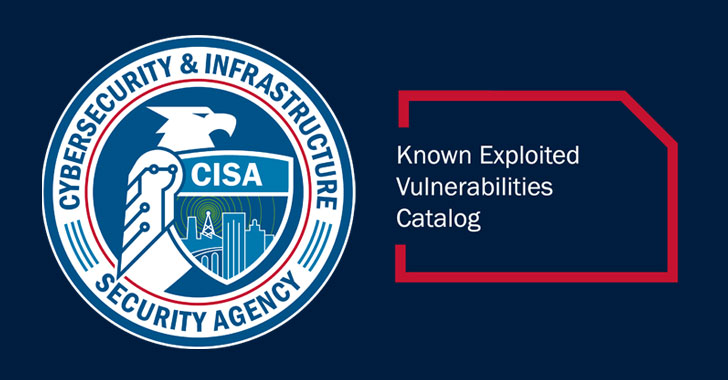

[](https://github.com/BenjiTrapp/cisa-known-vuln-scraper/actions/workflows/daily-scraper-cisa-kev.yml)

<p align="center">

<br>Daily scaraping of Known Exploited Vulnerabilities @ CISA
</p>

Mirroring `https://www.cisa.gov/sites/default/files/feeds/known_exploited_vulnerabilities.json`daily and stores it on GitHub, since CISA restricts access and applys rate limites. This simply helps to keep everything at one place, and my automation up and running. 

## How it works
The magic is done with the help of this [GitHub Action](.github/workflows/update.yaml)

## How to consume it

You can simply grep the file and search in it like this:

```bash
# Store file
curl https://raw.githubusercontent.com/BenjiTrapp/cisa-known-vuln-scraper/main/cisa-kev.json -o cisa-kev.json

# Search by product name
jq -r '.vulnerabilities[] | select(.product == "FTA")' cisa-kev.json

# Search by Product name
jq -r '.vulnerabilities[] | select(.vendorProject == "Progress")' cisa-kev.json

# Search by CVE
jq -r '.vulnerabilities[] | select(.cveID == "CVE-2023-34362")' cisa-kev.json
```
For integration within Gradle it would look like this:

```groovy

dependencyCheck {
    analyzers {
        knownExploitedURL = "https://raw.githubusercontent.com/BenjiTrapp/cisa-known-vuln-scraper/main/cisa-kev.json"
    }
}
```

# 🔮 CVE PrioMarble 🔮

This tool is based on some quick [researches related to EPSS (Exploit Prediction Scoring System)](https://github.com/BenjiTrapp/cisa-known-vuln-scraper/blob/main/epss_playground/epss-data-visualization.ipynb). The goal is to perform a priorization of known vulnerabilities within your environment by combining CVSS](https://nvd.nist.gov/vuln-metrics/cvss#), [EPSS](https://www.first.org/epss/data_stats), and 
CISA's [Known Exploited Vulnerabilities](https://www.cisa.gov/known-exploited-vulnerabilities-catalog). To achive this, this tool provides valuable insights into the likelihood of exploitation and potential impact.

## Why Combine CVSS, EPSS, and CISA's KEV?

The correlation between CVSS and EPSS scores help to enhance vulnerability remediation efforts. While CVSS captures the fundamental properties of a vulnerability, EPSS offers data-driven threat information, enabling you to better prioritize patching. 

A quick demo can be seen here:


```bash
# DEMO based on a file of CVEs
 python epss_prio_marble.py -f demo_cves.txt -v

 # Check a specific CVE
 python epss_prio_marble.py -c < add your CVE here e.g. CVE-2023-28250 >

# No idea? ask for help 
 python epss_prio_marble.py -h

```

The team at FIRST did an amazing job explaining why one would want to combine CVSS and EPSS in their 
[EPSS User Guide](https://www.first.org/epss/user-guide). The following material has been extracted from that document.

The figure below shows the correlation between EPSS and CVSS scores based on data from 05-16-2021. Recall that EPSS 
produces prediction scores between 0 and 1 (0 and 100%) where higher scores suggest higher probability of exploit. 
Each dot represents one or more vulnerabilities (CVEs). Some vulnerabilities are labeled for illustrative purposes.


First, observe how most vulnerabilities are concentrated near the bottom of the plot, and only a small percent of 
vulnerabilities have EPSS scores above 50% (0.5). While there is some correlation between EPSS and CVSS scores, overall,
this plot provides suggestive evidence that attackers are not only targeting vulnerabilities that produce the greatest 
impact, or are necessarily easier to exploit (such as for example, an unauthenticated remote code execution).

This is an important finding because it refutes a common assumption that attackers are only looking for (and using) 
the most severe vulnerabilities. And so, how then can a network defender choose among these vulnerabilities when 
deciding what to patch first?

CVSS is a useful tool for capturing the fundamental properties of a vulnerability, but it needs to be used in 
combination with data-driven threat information, like EPSS, in order to better prioritize vulnerability remediation 
efforts.

For the sake of discussion, consider the diagram below, which has been annotated to generally illustrate vulnerability 
prioritization.


- Vulnerabilities in the **bottom left** represent those that have both a lower probability of being exploited, and would 
incur a lower severity impact to the information system, and can therefore be **de-prioritized**. 
- Vulnerabilities in the **upper left** quadrant may be more likely to be exploited, but, on their own, would not critically impact the 
information system. (Further research, however, should be conducted in order to better understand how these sorts of 
vulnerabilities may be used in a chained attack.)
- Vulnerabilities in the **bottom right** represent those that, while may severely impact the information system, are much 
less likely to be exploited, relative to others, but should still be watched in the event that the threat landscape 
changes.
- Vulnerabilities in the **upper right** quadrant, on the other hand, are the most critical kinds of vulnerabilities which 
are both more likely to be exploited, and could fully compromise the information system, and should therefore be 
patched first.

This decision strategy as described above emphasizes the tremendous capability of EPSS. A network defender who has 
typically had to address thousands or tens of thousands of exposed vulnerabilities, is now able to spend fewer resources, 
to patch more vulnerabilities that are much more likely to be exploited. This capability to differentiate among 
vulnerabilities has never before been possible.

## What is now the approach of the CVE PrioMarble?

The prioritization thresholds based on FIRST's recommendations and some experience gained over the epss Jupyter Notebook. Summarized the approach is looking like this:

1. Additional to CVSS nand EPSS, the ** CISA's Known Exploited Vulnerabilities** are included aswell. This lay the fundamental priority to CVEs found in KEV.
2. If the **CVSS Threshold is set to 6.0**, this is representing the weighted average CVSS Score from [CVE Details](https://www.cvedetails.com/cvss-score-distribution.php).
3. The **EPSS Threshold is set to 0.2**, to be focused on vulnerabilities with higher relevance of all vulnerabilities above this threshold.

This approach categorizes vulnerabilities into five priority levels, allowing to allocate resources more effectively.

| **Priority** | **Description**                  |
|--------------|----------------------------------|
| Priority 1+  | CVEs found in CISA's KEV         |
| Priority 1   | CVEs in the Upper Right Quadrant |
| Priority 2   | CVEs in the Lower Right Quadrant |
| Priority 3   | CVEs in the Upper Left Quadrant  |
| Priority 4   | CVEs in the Lower Left Quadrant  |

Based on this take a look on the modified version of FIRST's recommendation after applying aboves approach:


> Note: You can also change the thresholds within the CVE PrioMarble to make it fitting to your policies

#### NVD API Notice: 
Please note that while this tool uses the NVD API, it is not endorsed or certified by the NVD.
